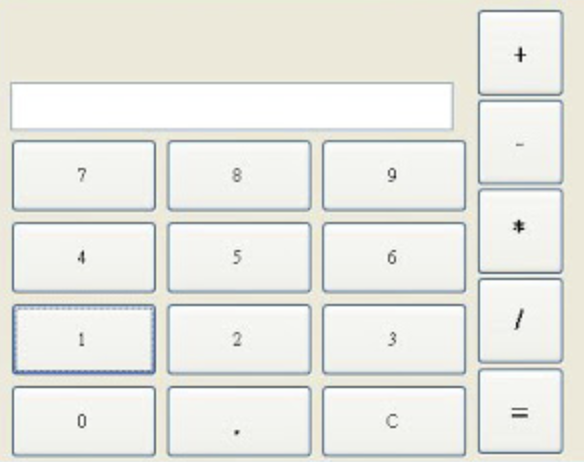

## 前端成長紀錄100天

### 1.透過JS呈現在頁面中間文字為"Hello Word"。
> 限制條件：文字顏色為藍色，字體大小為36px

### 2.建立五筆資料，內容其為姓名、性別、年齡，顯示在頁面上。
> 限制條件：性別(男、女)文字顏色分別藍色、紅色  
> 提示：使用物件陣列，例：{ name: 'jerry', nature: 'boy', age: 32 }

### 3.顯示表格月份及標示季節
> 限制條件：使用定義的陣列資料呈現內容  
<pre>
  <code>
    var monthList = [1,2,3,4,5,6,7, ..., 12];
    var seasonList = ['春天', '夏天', '秋天', '冬天'];
  </code>
</pre>

### 4.xxx學校全校共有30人，因應小班教學制，所以分了10個班，每班人數為3人，請畫出班級表格
> 限制條件：使用兩筆陣列清單呈現班級表格
<pre>
  <code>
    var studentList = [1,2,3,4,5,6,7, ..., 30];
    var classList = ['第一班', '第二班', ..., 第十班];
  </code>
</pre>

### 5.建立加法運算器
> 限制條件：建立計算機版型，0~9數字按鈕,+號按鈕,歸零C按鈕,等於按鈕
<pre>

</pre>

### 6. 使用JQuery套件Ajax呼叫測試API，取得每個人資訊清單，用console顯示每個名稱
> 限制條件：API Url https://jsonplaceholder.typicode.com/users

### 7. 建立表格顯示個人名稱、電話、住址資訊
> 限制條件：API Url https://jsonplaceholder.typicode.com/users

### 8. 操作陣列基本功
<pre>
  將以下兩組陣列合併:
  <code>
    var list1 = [1,2,3,4,5];
    var list2 = [6,7,8,9,10];
  </code>
</pre>
<pre>
  將名單移除Tom成員:
  <code>
    var nameList = ['Will', 'Jerry', 'Tom', 'Jack'];
  </code>
</pre>
<pre>
  將名單新增兩位成員分別為Mark、Bill在最後面。
  <code>
    var nameList = ['Will', 'Jerry', 'Tom', 'Jack'];
  </code>
</pre>
<pre>
  將Mark排在Jerry後，Bill排在Will前。
  <code>
    var nameList = ['Will', 'Jerry', 'Tom', 'Jack'];
  </code>
</pre>
<pre>
  產生基數列表清單:
  <code>
    var list = [1,3,5,7,...];
  </code>
</pre>
<pre>
  將陣列數值由大到小排列:
  <code>
    var list = [1,3,5,7,9,11];
  </code>
</pre>
### 9. ES6箭頭函數(arrow function)
1.forEach && map
2.Spread Operator
3.ES6 -String Interpolation
### 10.Destructuring Assignment
1.Array Matching
2.Class Inheritance 類繼承
### 11.React
1.input.2.button.
### 12.React Address Picker(地址選擇器)
1. city,  district , postalCode (縣市，地區，郵政編碼)
           
### 13.React Address Picker(地址選擇器)
1. city,  district , postalCode (縣市，地區，郵政編碼)
2.ReceiptType (發票類型)
### 14.React Address Picker(地址選擇器)
1.Material Components &Icons
### 15.React 點擊計數器
### 16.React 狀態開關器
### 17.React 購物車練習 
### 18.React 5ma平均值練習

